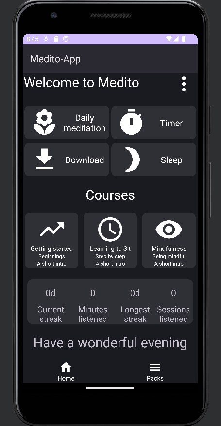

<h1>Medito Application</h1>

This is a project of a Medito-like application made in Android Studio with Kotlin.
  

<h2>Demo</h2>

<h2>Installation</h2>

  1. Firstly clone the repository into your folder on your device.   
  2. Secontly launch the application with your Mobile IDE.

 

<h2>Idea</h2>

The idea of the Medito application is to help developing the original Medito App in the future.

  

Made by <a href="https://github.com/patrikinho0">patrikinho</a>

